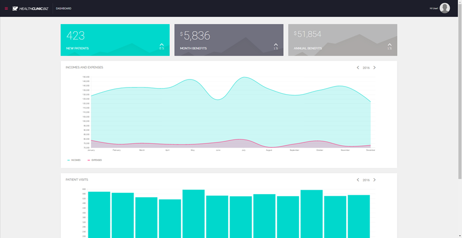

# SmartClinic - Smart Clinic App

## Overview
SmartClinic, a sample application built for demo and training purposes, is for a fictitious health care provider **SmartClinic.biz**. 
SmartClinic.biz uses different Microsoft and multi-channel apps built with Visual Studio and Azure to grow their business and modernize their customer experience. 
They also innovate and offer multiple apps and services—including websites, mobile apps, and wearable apps—to empower their patient’s well-being with easy access to manage their healthcare data and stay healthy.

**Note:** 
This repo was imported from the Azure Repos provided with this [Lab](https://github.com/Microsoft/azuredevopslabs/tree/master/labs/vstsextend/kubernetes/)

The code has been modified from the original version. The mobile (Xamarin and Cordova) projects have been removed and the web project has been upgraded to work in Visual Studio 2017.      
You can find the old, original code on this [GitHub repo](https://github.com/Microsoft/HealthClinic.biz)

## Licenses

This project uses some third-party assets with a license that requires attribution:

Roboto Font: by [Christian Robertson](https://plus.google.com/110879635926653430880/about) ([Roboto at Google Fonts](https://fonts.google.com/specimen/Roboto))
Raleway Font: by Matt McInerney, Pablo Impallari, Rodrigo Fuenzalida and by Igino Marini ([Raleway at Google Fonts](https://www.google.com/fonts/specimen/Raleway))
For additional information about the licenses, please see the dependency repositories.

